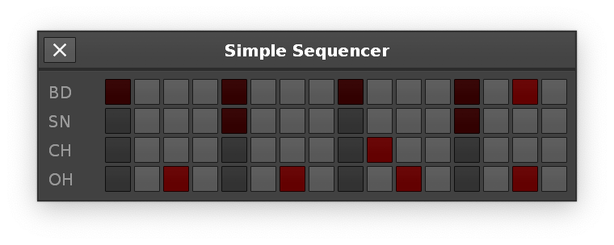

# simple step

This is a dumb & simple frontend for quickly adding beats to a pattern. I wanted a really fast & simple way to enter patterns from the [Pocket Operations](https://shittyrecording.studio/) book, which I highly recommend.

Lots of assumptions are about your setup, to keep it as simple as possible.

I have a bunch of instruments that have drum-samples, mapped like this:

- `C3` - BD (Bass Drum)
- `C#3` - SN (Snare Drum)
- `D3` - CH (Closed Hihat)
- `D#3` - OH (Open Hihat)

Whatever your current track is, it will add a chorded drum (so you can keep all your drums on 1 track.)

It will split a 64-line pattern (default) into 16 steps, so you have lots of room to fill. Setting `LPB` to 16 will make the `BPM` sensible.